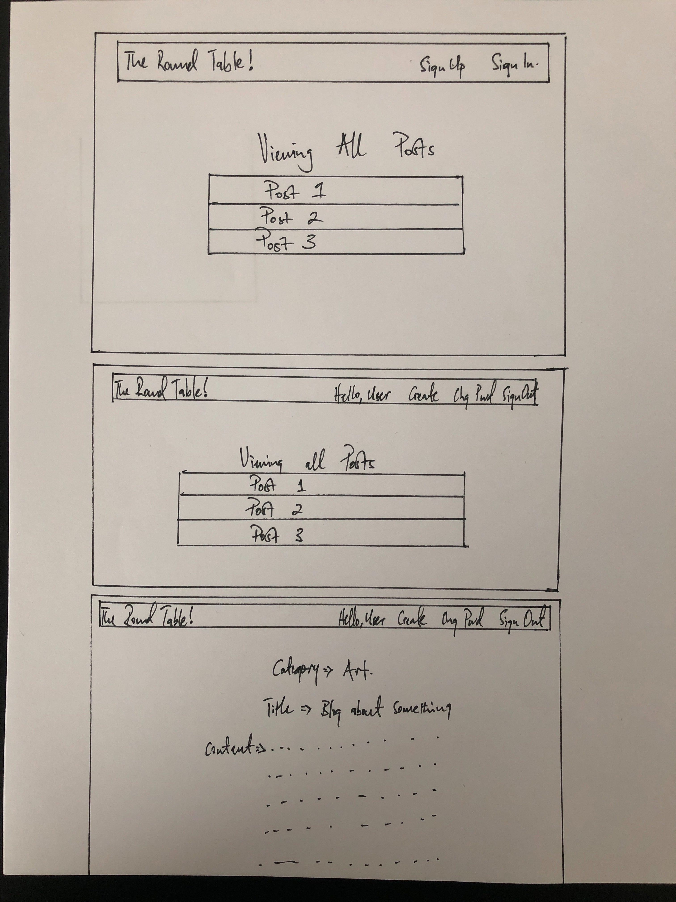
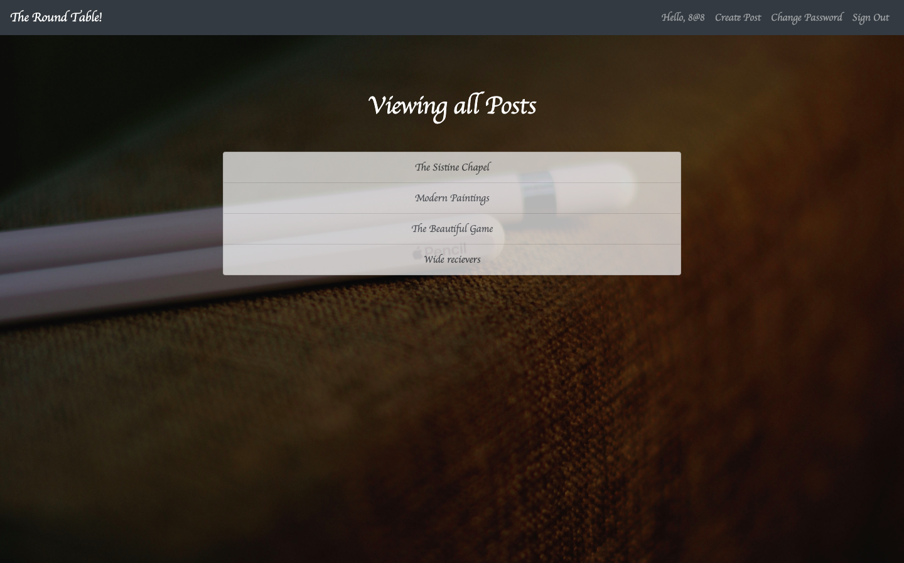

## GENERAL ASSEMBLY SEI CAPSTONE (Full-stack-project)

## ABOUT THE APP
  The Round Table app is a CRUD blog application that lets signed users create blog posts with a couple of different categories. The app also allows both authenticated and non authenticated users to view all available blog posts whether or not they are signed as I think it is an essential part of any blog site. That said, non authenticated users don't have the abilty to perform the create and delete actions as those are reserved for signed in users. 

## DEVELOPMENT PROCESS
 Having owned a blog in the past, I had a slight idea of what I wanted the front end to look like
 for the user. The plan was to give a user the ability to look at a post(s) whether or not they are signed in.
 With that in mind, I started the day with creating a the wireframe of what the front end would, and user stories to base the app on. Then I moved on to creating the CRUD actions in my React front end, these would enable to user to create, edit, delete and view one/all on a post(s). Once I got those in, I picked up from there the following day with creating a form that would render the actions in the app, along with building out the routes and links to provide end points for every action. Once all this done, I spent the third day and last day of the front end making the app's visual appearance nicer for my user.

## USER STORIES
 - As a user, I want to be able to sign-up
 - As a user, I want to be able to sign-in
 - As a user, I want to be able to change password
 - As a user, I want to be able to sign-out
 - As a user, I would like success/failure messages when I have completed an auth action.
 - As a signed in user, I would like to view all blog posts
 - As a signed in user, I would like to view one blog posts
 - As a signed in user, I would like to comment on a blog post
 - As a signed in user, I would like to delete a blog post
 - As an unregisted user, I would like to be able to view all available blogs
 - As an unregisted user, I would like to be able to view a single blog

## TECHNOLOGIES
- JavaScript
- CSS
- HTML
- Bootstrap
- React

## WIREFRAME

## APP IMAGE

## LINKS
